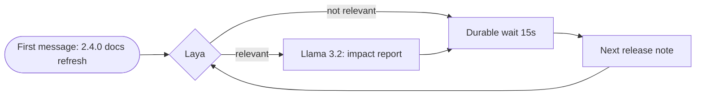

## What you're about to see

- **Fast brain:** Laya answers yes or no in milliseconds
- **Slow brain:** Llama 3.2 writes a report only when it matters
- **Backbone:** Cadence owns the timer, retries, and state
- **100% local:** no API keys, no cost
- **Continue-As-New after 20 loops:** Replay faster, no history limit concerns
